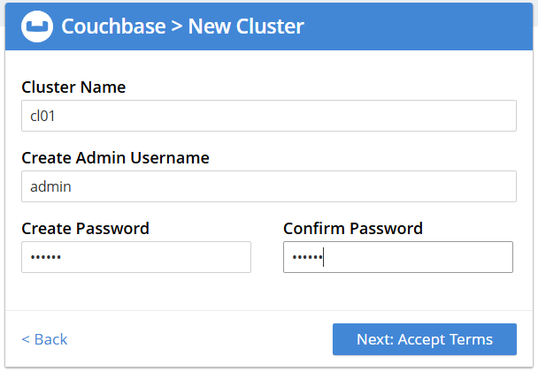

# Couchbase дз

Развернуть кластер Couchbase
Запускаем кластер с помощью предварительно подготовленного файла [docker-compose.yml](./docker-compose.yml)

```bash
docker compose up -d
```

Заходим через веб браузер на <http://localhost:8091/> для настройки.



Создать БД, наполнить небольшими тестовыми данными
Проверить отказоустойчивость

1. Прочитайте их, используя графический интерфейс или утилиту kafka-consumer

1. Отправьте и прочитайте сообщения программно - выберите знакомый язык программирования (C#, Java, Python или любой другой, для которого есть библиотека для работы с Kafka), отправьте и прочитайте несколько сообщений


