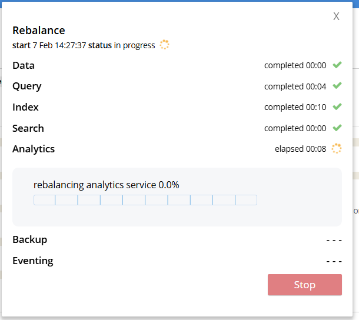
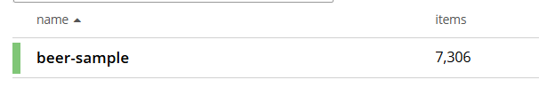

# Couchbase дз

* Развернуть кластер Couchbase.  
   
Запускаем кластер с помощью предварительно подготовленного файла [docker-compose.yml](./docker-compose.yml)  

```bash
docker compose up -d
```

Заходим через веб браузер на <http://localhost:8301/> для настройки.  
  
Добавляем 2 ноды к созданному кластеру и запускаем ребалансировку.  
  

* Создать БД, наполнить небольшими тестовыми данными  
   
Создаем бакет, загружаем туда тестовые данные
  

* Проверить отказоустойчивость

Делаем запрос к бд

```sql
SELECT *
FROM `beer-sample`.`_default`.`_default`
WHERE name = "21st Amendment Brewery Cafe"
```

Получаем результат

```json
[{
    "_default": {
        "name": "21st Amendment Brewery Cafe",
        "city": "San Francisco",
        "state": "California",
        "code": "94107",
        "country": "United States",
        "phone": "1-415-369-0900",
        "website": "http://www.21st-amendment.com/",
        "type": "brewery",
        "updated": "2010-10-24 13:54:07",
        "description": "The 21st Amendment Brewery offers a variety of award winning house made brews and American grilled cuisine in a comfortable loft like setting. Join us before and after Giants baseball games in our outdoor beer garden. A great location for functions and parties in our semi-private Brewers Loft. See you soon at the 21A!",
        "address": [
            "563 Second Street"
        ],
        "geo": {
            "accuracy": "ROOFTOP",
            "lat": 37.7825,
            "lon": -122.393
        }
    }
}]
```

Гасим первую ноду кластера

```bash
docker stop ad818e942ca0 
```

Кластер не работает (fatal just now  3.1s)  
Заходим на вкладку серверы, автоматически запускается фейловер, теперь запрос работает.  
Запускаем ребаланс, неисправный сервер пропадает из списка серверов.

Запускаем контейнер.
```bash
docker start ad818e942ca0 
```
Потребовалось добавление сервера, ребаланс стал завершаться с ошибкой , выведение и введение обратно в кластер не помогло, ребаланс со старым сервером не работает, предполагаю надо очистить диск контейнера и добавить его как новый сервер.

По итогу помогло только выключение и вкл кластера целиком, датамувер валился от недостатка ресурсов, очень жрущая бд.