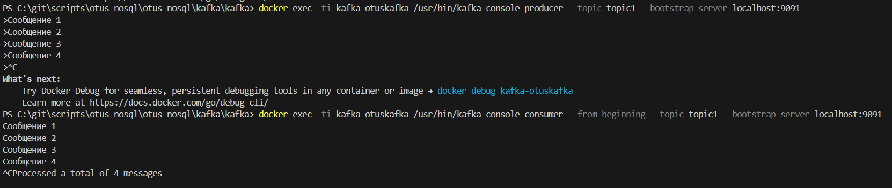
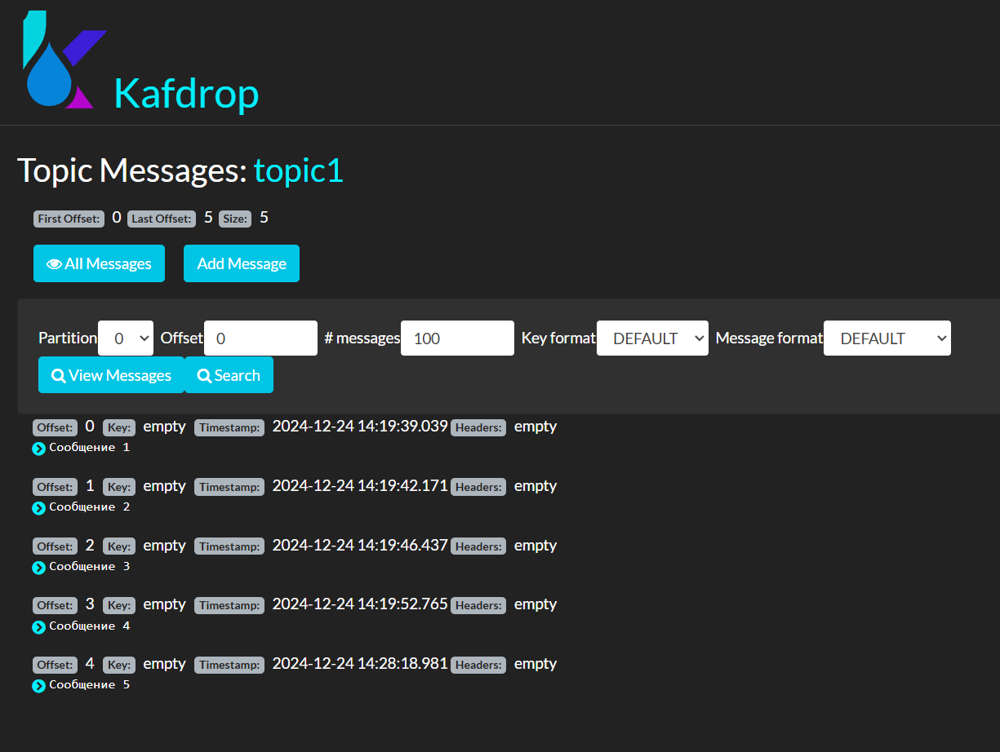
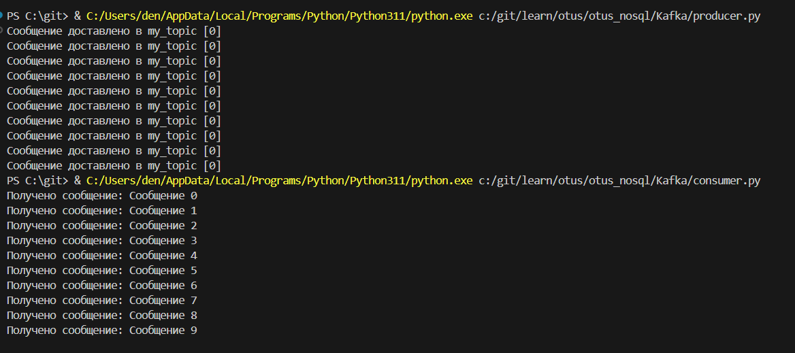

# Kafka дз

1. Запустите Kafka (можно в docker)
2. Отправьте несколько сообщений используя утилиту kafka-producer

3. Прочитайте их, используя графический интерфейс или утилиту kafka-consumer

4. Отправьте и прочитайте сообщения программно - выберите знакомый язык программирования (C#, Java, Python или любой другой, для которого есть библиотека для работы с Kafka), отправьте и прочитайте несколько сообщений

