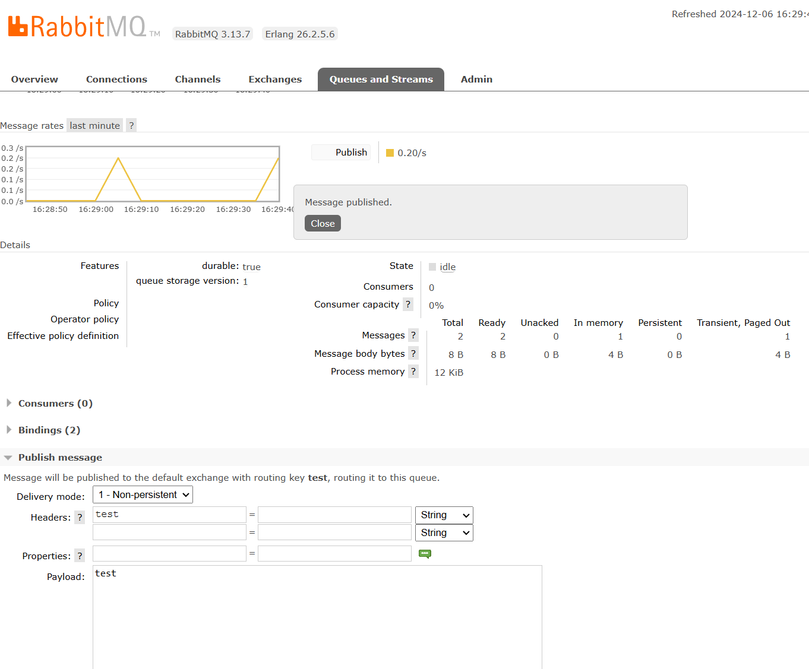
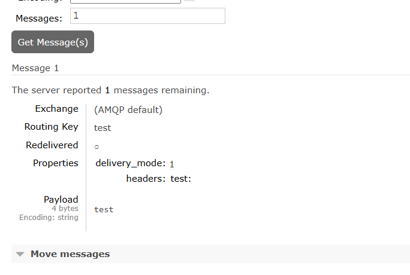

# RabbitMQ дз

1. Запустите RabbitMQ (можно в docker)
2. Отправьте несколько тем для сообщений через web UI

3. Прочитайте их, используя web UI в браузере

4. Отправьте и прочитайте сообщения программно - выберите знакомый язык программирования (C#, Java, Go, Python или любой другой, для которого есть библиотека для работы с RabbitMQ), отправьте и прочитайте несколько сообщений

**Запускаем RabbitMQ :**

```bash
docker run -it --rm --name rabbitmq -p 5552:5552 -p 15672:15672 -p 5672:5672  \
    -e RABBITMQ_SERVER_ADDITIONAL_ERL_ARGS='-rabbitmq_stream advertised_host localhost' \
    rabbitmq:3.13    
```

ждем пока запустится и выполняем команды:

```bash
docker exec rabbitmq rabbitmq-plugins enable rabbitmq_stream rabbitmq_stream_management  
```

ставим модуль для питона:

```bash
pip install rstream
```
Создаем файлы send.py и receive.py, заполняем из учебника на гите [Ссылка](https://github.com/rabbitmq/rabbitmq-tutorials/tree/main/python-stream)

Запускаем и видим результат:
```bash
PS C:\git\learn\otus\otus_nosql\RabbitMQ> python .\send.py
 [x] Hello, World! message sent
 [x] Press Enter to close the producer  ...
PS C:\git\learn\otus\otus_nosql\RabbitMQ> python .\receive.py
Press control + C to close
Got message: b'Hello, World!' from stream hello-python-stream
Closing Consumer...
```
