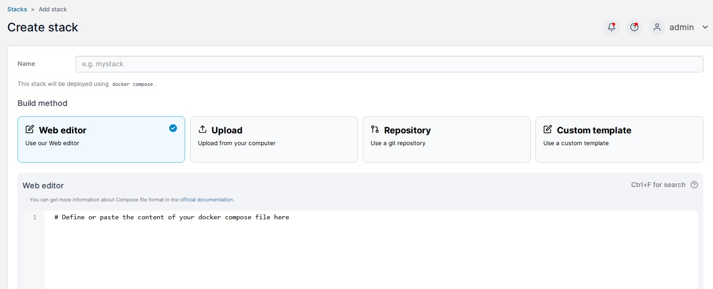
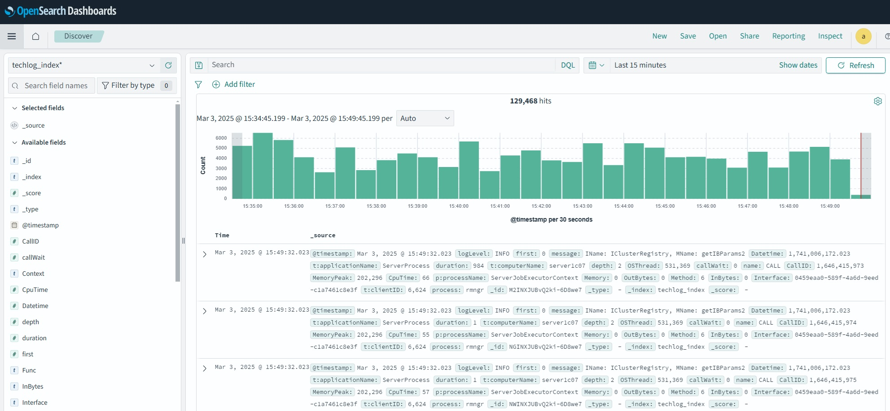

# Настройка сбора логов на основе fluentbit и базы opensearch

## 1.Сбор логов сервера 1с

Для начала необходимо настроить 1с для сбора логов технологического журнала.
Это делается при помощи файла [logcfg.xml](1с/logcfg.xml).
Этот файл необходимо настроить на сбор необходимой информации, в проекте он настроен на данные по утечке памяти, т.к. была проблема и копали по ней. Через 2 минуты после появления файла в папке /home/usr1cv8/.1cv8/1C/1cv8/conf/ сервера сервер начинает логгирование.

Объем логов на этом сервере за 2 часа:

```bash
du -h /var/log/1c1/logs
785M    /var/log/1c1/logs
```

> Внимание. вся эта сборка подходит только к версии 1с сервера старше 8.3.25, т.к. только тут начали применять формат json в логах и плоское расположение файлов.

Для примера выложил формат выходного файла с логами [example.log](1с/example.log)

## 2. Установка docker, portainer и запуск opensearch

### 2.1 Установка docker

Система у нас ubuntu 24.04

```bash
sudo apt install apt-transport-https ca-certificates curl software-properties-common -y
sudo curl -fsSL https://download.docker.com/linux/ubuntu/gpg -o /etc/apt/keyrings/docker.asc
echo "deb [arch=$(dpkg --print-architecture) signed-by=/etc/apt/keyrings/docker.asc] https://download.docker.com/linux/ubuntu $(. /etc/os-release && echo "$VERSION_CODENAME") stable" | sudo tee /etc/apt/sources.list.d/docker.list > /dev/null
sudo apt update
sudo apt-get install docker-ce docker-ce-cli containerd.io docker-buildx-plugin docker-compose-plugin
```

Проверяем, что все установилось правильно

```bash
docker --version
Docker version 27.4.0, build bde2b89
```

### 2.1 Установка portainer

```bash
docker volume create portainer_data
docker run -d -p 9000:9000 -p 9443:9443 --name=portainer --restart=always -v /var/run/docker.sock:/var/run/docker.sock -v portainer_data:/data portainer/portainer-ce:latest
```

Заходим на адрес http://192.168.5.197:9000/#!/home делаем предварительную настройку.

### 2.3 Установка opensearch и opensearch dashboards
В portainer создаем новый stack, добавляем в поле редактора содержимое файла [docker-compose.yml](docker-compose.yml)
Ждем когда развернется и проверяем заходя на адреса:  
https://192.168.5.197:9200/

```json
{
  "name" : "opensearch",
  "cluster_name" : "docker-cluster",
  "cluster_uuid" : "bxGP8jypTCqWx0dyWQ0zWw",
  "version" : {
    "distribution" : "opensearch",
    "number" : "2.19.0",
    "build_type" : "tar",
    "build_hash" : "fd9a9d90df25bea1af2c6a85039692e815b894f5",
    "build_date" : "2025-02-05T16:13:36.244552508Z",
    "build_snapshot" : false,
    "lucene_version" : "9.12.1",
    "minimum_wire_compatibility_version" : "7.10.0",
    "minimum_index_compatibility_version" : "7.0.0"
  },
  "tagline" : "The OpenSearch Project: https://opensearch.org/"
}
```

http://192.168.5.197:5601/  


Заходим делаем предварительную настройку.

## 3. Установка fluentbit, настройка отправки логов в opensearch

```bash
curl https://raw.githubusercontent.com/fluent/fluent-bit/master/install.sh | sh
systemctl enable fluent-bit
```

Копируем 3 файла из папки fluentbit по адресу /etc/fluent-bit/
Запускаем службу

```bash
systemctl start fluent-bit
systemctl status fluent-bit

● fluent-bit.service - Fluent Bit
     Loaded: loaded (/usr/lib/systemd/system/fluent-bit.service; enabled; preset: enabled)
     Active: active (running) since Wed 2025-02-26 11:00:11 MSK; 5 days ago
       Docs: https://docs.fluentbit.io/manual/
   Main PID: 1648883 (fluent-bit)
      Tasks: 3 (limit: 618651)
     Memory: 21.2M (peak: 88.6M swap: 4.4M swap peak: 4.4M)
        CPU: 1h 8min 56.226s
     CGroup: /system.slice/fluent-bit.service
             └─1648883 /opt/fluent-bit/bin/fluent-bit -c //etc/fluent-bit/fluent-bit.conf

мар 03 15:00:11 server1c07 fluent-bit[1648883]: [2025/03/03 15:00:11] [ info] [input:tail:tail.0] inotify_fs_add(): inode=23070125 watch_fd=6764 name=/var/log/1c1/logs/rphost_437976_250303>
мар 03 15:00:11 server1c07 fluent-bit[1648883]: [2025/03/03 15:00:11] [ info] [input:tail:tail.0] inotify_fs_add(): inode=23074706 watch_fd=6765 name=/var/log/1c1/logs/rphost_439057_250303>
мар 03 15:00:11 server1c07 fluent-bit[1648883]: [2025/03/03 15:00:11] [ info] [input:tail:tail.0] inotify_fs_add(): inode=23074251 watch_fd=6766 name=/var/log/1c1/logs/rphost_440042_250303>
```

По логам службы видно, что служба запущена и началась отправка логов в opensearch
Смотрим в opensearch



Видим, что логи пошли, осталось настроить политику по автоматическому удалению старых логов.
Сделал это в графической оболочке open dashboards, но можно и напрямую в opensearch 3 запросами.

Это сама политика
```json
{
    "policy": {
        "policy_id": "delete_old_data",
        "description": "A sample description of the policy",
        "last_updated_time": 1740667859906,
        "schema_version": 21,
        "error_notification": null,
        "default_state": "hot",
        "states": [
            {
                "name": "hot",
                "actions": [],
                "transitions": [
                    {
                        "state_name": "delete",
                        "conditions": {
                            "min_index_age": "7d"
                        }
                    }
                ]
            },
            {
                "name": "delete",
                "actions": [
                    {
                        "retry": {
                            "count": 3,
                            "backoff": "exponential",
                            "delay": "1m"
                        },
                        "delete": {}
                    }
                ],
                "transitions": []
            }
        ],
        "ism_template": [
            {
                "index_patterns": [
                    "techlog_index*"
                ],
                "priority": 1,
                "last_updated_time": 1740667208707
            }
        ]
    }
}
```

На этот проект я потратил 2 недели, до этого неделю перебирал варианты, которые не заводились, либо уже сильно устарели.
Из-за зоопарка дистрибутивов elastic и opensearch достоверную информацию очень трудно найти ,.. так что пришлось использовать документацию и 2 нейросети чтобы прояснить причину неработы на разных моментах. 